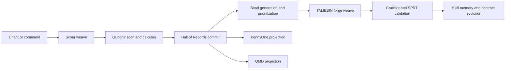

# Corvus Star Woven Skill Consolidation Blueprint

## Purpose

This blueprint defines the target operating model for Corvus Star as a woven skill system.
It replaces the current mixed state of hard-wired daemons, direct module pathways, and partially skill-based execution with one canonical spine.

Related architecture note:

- `docs/architecture/CHANT_AND_EVOLVE_WOVEN_MAPPING.qmd`

The target system is:

1. Scan a repository.
2. Score it with the Gungnir Matrix.
3. Store canonical records in the Hall of Records.
4. Project those records into PennyOne and QMD.
5. Create beads that identify the next unit of work.
6. Execute change through woven skills, led by TALIESIN Forge.
7. Validate improvement through tests and SPRT.
8. Update skill learning artifacts without allowing intent drift.

## Singular Vision

Corvus Star is not a daemon framework with skills attached.
Corvus Star is a skill fabric with a thin runtime around it.

The runtime exists only to:

- accept intent
- resolve the right skill weave
- run the weave
- record the outcome
- project the state

Everything else is a skill, a contract, or a projection.

## Canonical Execution Spine

This is the only allowed high-level path after consolidation.

## Architectural Laws

### 1. Skills are the only execution unit

No major capability may remain hard-wired inside a daemon, command spoke, or bridge file.
Command handlers may dispatch. They may not own business logic.

### 2. Runtime roles are weaves, not monoliths

Huginn, Muninn, PennyOne, and TALIESIN may remain as conceptual identities, but each must be implemented as a named weave of skills.

### 3. One authority per concern

Every important concern must have one canonical store and zero ambiguity.
All other outputs are projections, caches, reports, or compatibility layers.

### 4. QMD is projection-first

QMD remains valuable, but it cannot be the hidden authority for runtime state.
QMD should document, explain, and project.
SQLite and stable structured ledgers should hold operational truth.

### 5. Gherkin contracts must separate authority from learning

Each skill and critical file may have:

- a canonical contract
- execution observations
- a proposed contract evolution

Observed success or failure must not silently rewrite authoritative intent.
Promotion of evolved contracts must be explicit and validated.

### 6. PennyOne is a projection surface

PennyOne should consume canonical Hall records and telemetry.
It should not infer core truth from ad hoc files or unstable intermediate outputs.

## Target Runtime Roles

### Huginn

Huginn becomes the routing and prioritization weave.

Responsibilities:

- repository scour coordination
- intent routing
- Gungnir scan orchestration
- bead generation
- next-target selection

### Muninn

Muninn becomes the memory and evolution weave.

Responsibilities:

- Hall of Records commit
- skill outcome capture
- contract observation storage
- proposed contract evolution
- trajectory and session memory

### TALIESIN

TALIESIN becomes the forge weave.

Responsibilities:

- plan-to-change translation
- code generation and refactoring
- contract-first implementation support
- test generation where required

### PennyOne

PennyOne becomes the projection weave.

Responsibilities:

- matrix visualization
- telemetry projection
- trajectory playback
- state inspection

## Canonical Authorities

| Concern | Canonical authority | Projection or cache |
| --- | --- | --- |
| Skill definition | `.agents/skills/<skill>/` | `src/skills/local/`, generated docs |
| Skill contract | `.feature` file beside skill or mapped contract ledger | reports, summaries |
| Persona and sovereign identity | `.agents/sovereign_state.json` | HUD output, docs |
| Repository scan result | Hall schema in SQLite-ledger form | QMD summaries, PennyOne JSON views |
| Gungnir matrix and baseline | Hall schema tables or equivalent stable ledger | rendered dashboards |
| Bead queue | dedicated bead ledger or Hall table | task summaries, docs |
| Forge result | candidate session record and validation record | session logs |
| SPRT verdict | validation ledger | console output |
| Skill learning observations | outcome and observation ledger | promoted contract proposals |

### Target storage rule

The preferred steady state is:

- structured state in SQLite or stable JSON ledgers
- QMD generated from structured state
- visual layers read from structured state

## Woven Skill Families

The target architecture should organize around these families.

### 1. Scour family

Purpose:

- walk repository trees
- normalize files
- collect file metadata
- identify scan targets

Expected outputs:

- repository snapshot
- file manifest
- changed-sector set

### 2. Gungnir family

Purpose:

- compute the eight-axis matrix
- compute per-file and repository-level health
- identify anomalies and anchors

Expected outputs:

- per-file matrix
- repository baseline
- delta trajectory

### 3. Hall family

Purpose:

- persist scan results
- persist score history
- persist intent summaries
- persist trajectory records

Expected outputs:

- authoritative Hall records
- point-in-time repository state
- longitudinal history

### 4. Bead family

Purpose:

- turn Hall records into work units
- rank opportunities by risk, score, gravity, and strategic value
- feed TALIESIN a bounded target

Expected outputs:

- bead queue
- bead rationale
- target acceptance criteria

### 5. Forge family

Purpose:

- execute change through skill composition
- build code, tests, and contract updates
- preserve intent while improving score

Expected outputs:

- candidate patch
- supporting tests
- validation request

### 6. Validation family

Purpose:

- verify unit and integration behavior
- re-run Gungnir
- perform SPRT confirmation
- reject score regressions

Expected outputs:

- pass or fail verdict
- score delta
- SPRT decision

### 7. Evolution family

Purpose:

- capture outcomes
- compare expected versus actual behavior
- generate contract evolution proposals for skills

Expected outputs:

- observation record
- proposed contract diff
- promotion recommendation

### 8. Projection family

Purpose:

- publish PennyOne-compatible views
- publish QMD summaries
- provide operator status and audits

Expected outputs:

- matrix views
- trajectory views
- operator reports

## Current Repo to Target Architecture Map

### A. Orchestration shell

| Current area | Current role | Target role | Action | Notes |
| --- | --- | --- | --- | --- |
| `cstar.ts` | top-level CLI and control plane | thin runtime entrypoint | Rewrite | Keep as shell only. Move orchestration logic into skill runtime dispatch. |
| `src/node/core/commands/*.ts` | command spokes | dispatch adapters | Rewrite | Commands should resolve a weave and pass structured payloads. No embedded business logic. |
| `src/tools/corvus-control-mcp.ts` | MCP bridge | canonical external orchestration gate | Keep | This should become the preferred high-level execution interface. |
| `src/core/cstar_dispatcher.py` | legacy Python dispatcher | compatibility adapter | Adapter then retire | Keep only until all important flows are routed through the woven runtime. |

### B. Huginn: routing, scan, prioritization

| Current area | Current role | Target role | Action | Notes |
| --- | --- | --- | --- | --- |
| `src/core/sv_engine.py` | vector-driven intent engine | Huginn orchestration adapter | Keep and refactor | Narrow to routing and selection. |
| `src/core/engine/vector.py` | vector matching | Huginn skill | Keep | Candidate core for routing family. |
| `src/core/engine/vector_router.py` | route glue | Huginn skill | Keep | Fold into routing family contract. |
| `src/core/engine/vector_ingest.py` | vector ingest | Huginn skill | Keep | Should feed scan and intent indexes. |
| `src/core/engine/vector_calculus.py` | scoring helper | Gungnir or Huginn support skill | Keep | Place under one stable schema. |
| `src/core/engine/cognitive_router.py` | selection logic | Huginn skill | Keep and consolidate | Avoid overlap with `sv_engine.py`. |
| `src/core/norn_coordinator.py` | task selection | bead prioritization skill | Rewrite | Align with bead queue and acceptance criteria. |
| `src/core/annex.py` | repository annex and scan support | scour skill | Keep and split | Separate file ingestion from Hall persistence. |

### C. Gungnir calculus and audit

| Current area | Current role | Target role | Action | Notes |
| --- | --- | --- | --- | --- |
| `src/core/engine/gungnir/universal.py` | universal matrix engine | canonical Gungnir calculus skill | Keep | This should define the stable scoring schema. |
| `src/core/metrics.py` | repository metrics | Gungnir support skill | Keep and align | Output must match Hall schema. |
| `src/sentinel/score_cohesion.py` | cohesion scoring | Gungnir support skill | Keep or merge | Merge if duplicative. |
| `src/tools/code_sentinel.py` | scan logic | validation or Gungnir spoke | Keep and normalize | Treat as one scanner among many, not a parallel truth source. |
| `src/tools/js_sentinel.ts` | TS scan logic | validation or Gungnir spoke | Keep and normalize | Same schema as Python scanners. |
| `src/tools/security_scan.py` | security scan | validation spoke | Keep | Feed anomaly axis or dedicated risk channel. |
| `src/core/sterling_auditor.py` | file audit | validation spoke | Keep | Should consume canonical matrix inputs. |

### D. Hall of Records and memory

| Current area | Current role | Target role | Action | Notes |
| --- | --- | --- | --- | --- |
| `src/core/engine/memory_db.py` | memory persistence | Hall persistence skill | Keep and consolidate | Good candidate core for durable structured state. |
| `src/core/mimir_client.py` | Python bridge to oracle and synapse | intelligence adapter | Rewrite | Define one canonical bridge contract and one compatibility wrapper. |
| `src/core/mimir_client.ts` | TS bridge | intelligence adapter | Rewrite | Eliminate drift between TS and Python bridges. |
| `src/core/mimir_client.js` | duplicate bridge artifact | generated or legacy shim | Retire | Keep only if a build explicitly needs it. |
| `src/tools/archive_consolidator.py` | archive merge logic | Hall projection or migration skill | Keep and refactor | Use only against canonical records. |
| `src/tools/vault.py` | state storage helper | Hall support skill | Keep and clarify | Assign exact authority or demote to helper. |
| `.stats/pennyone.db` | current state ledger | Hall authority candidate | Keep and normalize | One DB is better than many ad hoc ledgers. |
| `.stats/gravity.db` | metrics ledger | Hall authority candidate | Merge | Fold into a single Hall schema where possible. |
| `.agents/synapse.db` | oracle exchange ledger | intelligence transport ledger | Keep | Transport state only, not canonical repository truth. |

### E. Beads and execution planning

| Current area | Current role | Target role | Action | Notes |
| --- | --- | --- | --- | --- |
| `tasks.qmd` | human-readable work ledger | projection of bead queue | Rewrite | Generate from structured bead state rather than using as authority. |
| `src/core/norn_coordinator.py` | task selection | bead engine | Keep and refactor | This should become the bead ranking core. |
| `.agents/workflows/*.md` | workflow definitions | weave entrypoints | Keep | Use as orchestration recipes, not hidden business logic. |
| `.agents/lore/*.qmd` | chants and intent | operator input and narrative context | Keep | Convert chants into structured requests before execution. |

### F. TALIESIN forge and implementation

| Current area | Current role | Target role | Action | Notes |
| --- | --- | --- | --- | --- |
| `src/sentinel/taliesin_forge.py` | forge skill | TALIESIN core skill | Keep | Strong candidate for canonical forge entry. |
| `src/sentinel/taliesin.py` | larger TALIESIN logic | TALIESIN weave | Keep and split | Extract generation, staging, and promotion into discrete skills. |
| `src/core/engine/skill_forger.py` | skill generation helper | TALIESIN support skill | Keep | Focus on skill construction and refinement. |
| `src/core/engine/builder.py` | build helper | forge support skill | Keep or merge | Avoid overlapping plan and patch logic. |
| `src/tools/generate_tests.py` | test generation | forge support skill | Keep | Treat as forge sidecar, not standalone workflow authority. |

### G. Validation, Crucible, and SPRT

| Current area | Current role | Target role | Action | Notes |
| --- | --- | --- | --- | --- |
| `src/sentinel/muninn_crucible.py` | forge validation | validation skill | Keep | Move under Muninn validation weave. |
| `src/tools/benchmark_engine.py` | perf regression checks | validation skill | Keep | Feed into final forge verdict. |
| `sterileAgent/fishtest.py` | SPRT and stability logic | canonical SPRT skill | Keep and promote | This should be first-class in the validation family. |
| `tests/unit`, `tests/integration`, `tests/empire_tests`, `tests/crucible` | verification suites | canonical contract and regression suites | Keep | These become the hard gate on woven execution. |
| `src/tools/compile_failure_report.py` | failure summarization | validation projection skill | Keep | Good for operator-facing postmortems. |

### H. Muninn and legacy daemonization

| Current area | Current role | Target role | Action | Notes |
| --- | --- | --- | --- | --- |
| `src/sentinel/main_loop.py` | daemon loop | legacy runtime loop | Retire | Replace with explicit weave execution. |
| `src/sentinel/muninn.py` | autonomous daemon entry | Muninn weave facade | Adapter then retire | Keep only as transition wrapper. |
| `src/sentinel/muninn_heart.py` | loop state and coordination | Muninn support skill | Keep and split | Preserve logic, remove daemon ownership. |
| `src/sentinel/muninn_memory.py` | memory side | Muninn support skill | Keep | Fold into Hall and evolution family. |
| `src/sentinel/muninn_hunter.py` | hunt logic | bead or validation skill | Keep and move | It should become one stage, not a runtime identity. |
| `src/sentinel/coordinator.py` | loop coordinator | runtime adapter | Rewrite | Centralize under skill dispatcher. |
| `src/cstar/core/daemon.py` | legacy daemon transport | compatibility bridge | Retire | Remove when woven runtime is stable. |
| `src/cstar/core/rpc.py` | RPC bridge | compatibility bridge | Adapter | Keep only for backward compatibility. |
| `src/cstar/core/uplink.py` | oracle bridge | compatibility bridge | Rewrite | Reduce to a thin shim over the canonical bridge contract. |

### I. PennyOne projection layer

| Current area | Current role | Target role | Action | Notes |
| --- | --- | --- | --- | --- |
| `src/tools/pennyone/` | matrix compiler, telemetry, 3D view | PennyOne projection weave | Keep | Valuable surface, but it must read canonical Hall outputs. |
| `src/node/core/commands/pennyone.ts` | PennyOne command entry | dispatch adapter | Keep and thin | Should only invoke the PennyOne weave. |
| `.stats/matrix-graph.json` | projected matrix view | derived artifact | Retire as authority | Generate from Hall, do not treat as source of truth. |

### J. Skill ecosystem

| Current area | Current role | Target role | Action | Notes |
| --- | --- | --- | --- | --- |
| `.agents/skills/*` | live skill registry | canonical skill packages | Keep | This should be the authority for the woven system. |
| `src/skills/local/*` | embedded local skills | compatibility and bootstrap skills | Adapter or migrate | Move durable skills into `.agents/skills/` or generate them from one source. |
| `skills_db/` | auxiliary skill registry | secondary registry | Merge or retire | Avoid dual authority for skill discovery. |
| `.agents/workflows/*` | recipes | weave manifests | Keep | Tie each workflow to explicit skills and contracts. |

### K. Lore, docs, and reports

| Current area | Current role | Target role | Action | Notes |
| --- | --- | --- | --- | --- |
| `README.qmd`, `walkthrough.qmd`, `memory.qmd`, `dev_journal.qmd` | narrative state | operator documentation and reports | Keep | Projection only. |
| `docs/architecture/*.qmd` | design documents | architectural memory | Keep | Add target-state documents here. |
| root-level logs, result dumps, and generated reports | mixed artifacts | generated outputs | Quarantine or ignore | These should not compete with canonical runtime state. |

## Transition Decisions

Use these labels during consolidation.

### Keep

The component is strategically correct and should remain, though its contract may need tightening.

### Adapter

The component provides compatibility value during migration but should not remain a primary execution path.

### Rewrite

The capability is needed, but the current ownership boundary or interface is wrong.

### Retire

The component represents obsolete architecture, duplicate authority, or a misleading source of truth.

## Immediate Consolidation Sequence

### Phase 1: Freeze the spine

Goals:

- define the canonical Hall schema
- define the bead schema
- define the skill execution contract
- define the forge validation contract

Execution backlog:

- `docs/architecture/PHASE_1_IMPLEMENTATION_BACKLOG.qmd`

Files to focus on first:

- `cstar.ts`
- `src/node/core/commands/*.ts`
- `src/core/mimir_client.py`
- `src/core/mimir_client.ts`
- `src/core/engine/gungnir/universal.py`
- `src/core/engine/memory_db.py`
- `src/sentinel/taliesin_forge.py`
- `src/tools/pennyone/`

### Phase 2: Remove hidden authorities

Goals:

- stop treating QMD and ad hoc JSON artifacts as canonical runtime state
- generate projections from structured Hall records
- move beads out of narrative documents and into structured state

### Phase 3: Break the daemon monoliths into skill stages

Goals:

- extract hunt, memory, validation, and promotion stages from Muninn loops
- expose each stage as a skill with a contract and test surface
- convert old daemon commands into transition adapters

### Phase 4: Standardize TALIESIN execution

Goals:

- require bead input
- require contract input
- require validation output
- forbid direct forge cycles that bypass Hall update and SPRT

### Phase 5: Stabilize PennyOne against the canonical schema

Goals:

- compile PennyOne only from Hall projections
- remove assumptions tied to temporary graph formats
- ensure matrix visualization is downstream, not upstream

### Phase 6: Promote skill learning safely

Goals:

- store outcome observations separately from canonical contracts
- generate proposed contract evolutions
- validate before promotion

## Definition of Done

Corvus Star is consolidated when the following are true:

1. Every top-level command dispatches into the same woven skill runtime.
2. No daemon loop owns exclusive business logic.
3. Gungnir scoring uses one stable schema across Python and TypeScript.
4. The Hall of Records is the single authority for repository scan state.
5. PennyOne reads projections of Hall state rather than ad hoc artifacts.
6. Beads are structured work units with traceable acceptance criteria.
7. TALIESIN forge always emits validation-ready candidates.
8. SPRT and score deltas gate promotion.
9. Skill contracts evolve through reviewed promotion, not silent mutation.
10. QMD documents explain and project the system but do not secretly govern it.

## First Tactical Cuts

If consolidation starts now, these are the highest-leverage cuts.

1. Make `cstar.ts` and `src/node/core/commands/*.ts` pure dispatch surfaces.
2. Pick one canonical Mimir bridge contract and demote all other variants to thin shims.
3. Define one Hall schema that both Gungnir and PennyOne must obey.
4. Move bead state out of `tasks.qmd` and into structured storage.
5. Extract Muninn phases into named skills and mark the loop files as transition wrappers.
6. Declare `.agents/skills/` the authoritative skill registry and reduce duplication with `src/skills/local/`.
7. Treat all compile failures and collection failures as consolidation blockers until the spine is stable.

## Closing Mandate

The goal is not to reduce Corvus Star into a smaller system.
The goal is to make the existing ambition executable through one enforceable architecture.

Corvus Star should feel like one mind because it runs on one spine.
