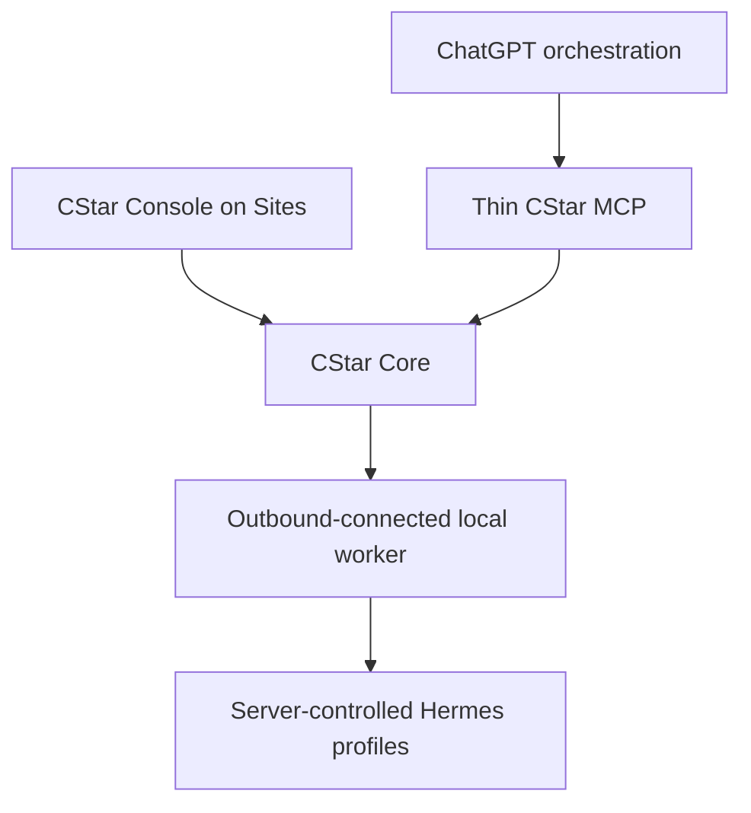
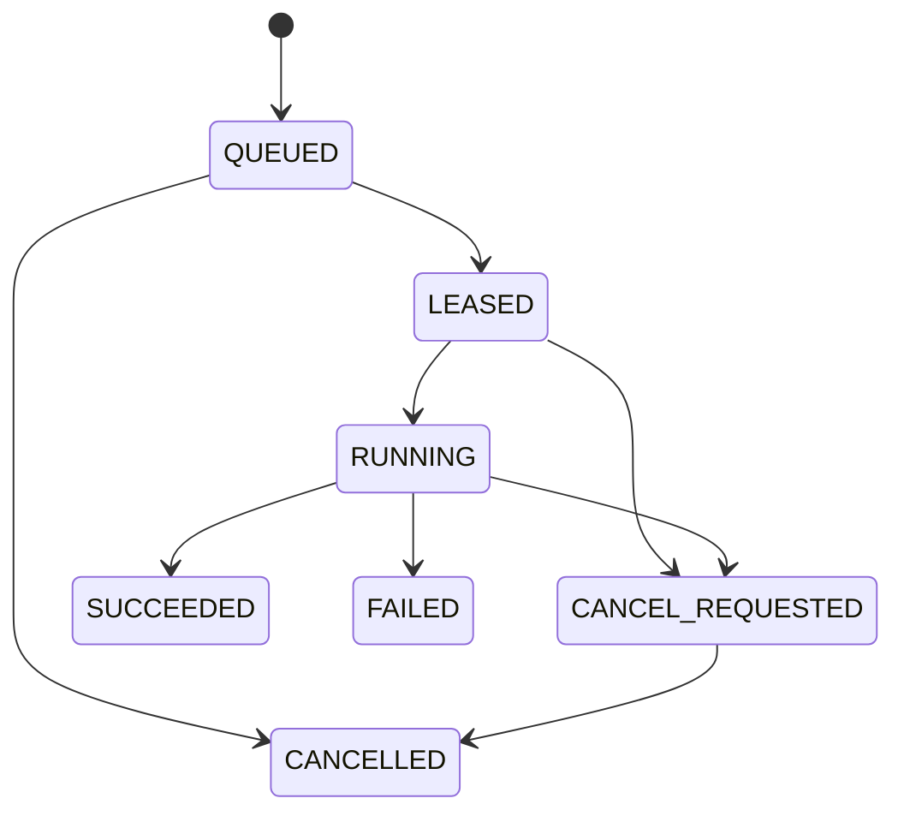

# CStar v2 Control Plane and Hosting Boundary

## Status

This document defines the target boundary for the preliminary CStar v2 worker
control plane. The preliminary implementation is an inert, feature-gated job
broker. It can record and inspect work orders, but it cannot invoke Hermes,
MiniMax, xPremium OAuth, Forge, Researcher, or any other worker.

The developed Forge and Researcher profiles remain local until their
versionable assets have been inventoried, reviewed, and imported through
`docs/operations/hermes-profile-intake/`.

## Architectural Decision

CStar v2 separates conversational orchestration, deterministic control-plane
state, and high-volume worker execution:



| Component | Owns | Must not own |
|---|---|---|
| ChatGPT | Natural-language understanding, planning, review, and synthesis | Hermes credentials, local paths, or worker process control |
| Thin CStar MCP | Small typed requests and deterministic result projection | Model inference, shell execution, provider selection, or direct profile invocation |
| CStar Core | Job state, policy, idempotency, cancellation, provenance, artifacts, and audit | User-facing language interpretation or caller-selected execution internals |
| Local worker | Future job leases, bounded execution, progress, and sanitized artifact publication | Public API design, operator identity, or CStar lifecycle authority |
| Hermes profiles | Specialized Forge and Researcher behavior through MiniMax/xPremium OAuth | CStar job authority, deployment authority, or credential disclosure |
| CStar Console | Persistent plans, job state, evidence, artifacts, approvals, and outcomes | A second source of truth or a required MCP round trip for every UI action |

The worker maps `worker_kind: "forge"` and `worker_kind: "researcher"` to
server-controlled profile registrations. A caller never supplies a provider,
model, Hermes profile name, OAuth reference, command, lease token, filesystem
root, or storage path.

## Preliminary Worker-Job Surface

The surface is disabled unless:

```text
CSTAR_KERNEL_ENABLE_WORKER_JOBS_V2=1
```

Unset values and every value other than the exact string `1` leave all four
tools absent from `tools/list`.

| Tool | Public purpose |
|---|---|
| `cstar_start_worker_job` | Persist one inert, idempotent work order |
| `cstar_get_worker_job` | Return the bounded public projection of one job |
| `cstar_cancel_worker_job` | Cancel queued work or request cancellation of future active work |
| `cstar_fetch_worker_artifact` | Return published artifact metadata and opaque delivery, never a storage path |

`cstar_start_worker_job` accepts only:

- `worker_kind`: `forge` or `researcher`;
- `objective`: ordinary natural language;
- `workspace_ref`: a logical CStar workspace identifier, never a path;
- `expected_artifacts[]`: `{ name, artifact_kind, required? }`;
- `idempotency_key`;
- optional `bead_id`.

The first matching call persists a server-generated job in `QUEUED` state and
returns `status: "queued"`, `deduplicated: false`, and
`execution_available: false`. The same repository-scoped idempotency key and
canonical request returns the current form of the same job with
`status: "existing"` and `deduplicated: true`. Its durable state is not reset;
an idempotent replay can therefore honestly return a cancelled or terminal
job. Reusing the key for a different request fails with
`IDEMPOTENCY_CONFLICT` and creates no second job or event.

The durable state vocabulary is:



`LEASED` and later execution states are reserved for the future local worker.
The preliminary broker can create only `QUEUED` and can cancel queued work
without executing it.

Public job and artifact projections must omit provider, model, profile,
OAuth, credentials, commands, leases, tokens, local paths, and storage
references. Unknown, unpublished, or unready artifacts fail with a structured
error. Cancellation is idempotent: queued work becomes `CANCELLED`; future
leased or running work becomes `CANCEL_REQUESTED`; repeated requests do not
create duplicate events. A terminal success or failure is not rewritten by a
late cancellation request.

## Preliminary Legacy Containment

The v2 scaffold does not make the legacy execution surfaces suitable for a
remote production MCP. This branch narrows their default behavior while they
remain available for local migration and compatibility:

| Legacy surface | Default | Exact server opt-in |
|---|---|---|
| AutoBot registration | Absent | `CSTAR_KERNEL_ENABLE_AUTOBOT=1` |
| Legacy live dispatch and Forge execution | Blocked before adapter invocation | `CSTAR_KERNEL_ENABLE_LEGACY_LIVE_EXECUTION=1` |
| Mongo mailbox writes | Blocked | `CSTAR_KERNEL_ENABLE_MONGO_MAILBOX_WRITES=1` |

These flags are transitional, local-only compatibility gates. They do not
create verified identity, scoped authorization, OAuth, safe remote path
boundaries, or replay protection. Do not enable them on a remotely reachable
MCP. In particular, caller-supplied authorization text is not a substitute for
the future signed, server-issued approval grant.

The tracked `.agents/daemon.key` and `.agents/daemon.pid` runtime artifacts are
removed from the current tree and ignored. If the historical key ever carried
authority, rotate or revoke it before any remote pilot; removing the current
file does not erase Git history.

The legacy loopback TCP bridge is outside the v2 transport contract. Treat it
as a local development surface only and never publish or proxy it. Production
remote MCP work starts with a separately authenticated Streamable HTTP/OAuth
proof, not by exposing the legacy bridge.

### Gates Before Any Live or Remote Worker

The inert scaffold deliberately stops short of three identity and integrity
boundaries. They are release blockers, not optional hardening:

- bind every job to a server-derived authenticated subject and tenant, then
  enforce that ownership on read, cancel, and artifact fetch;
- authenticate and register the outbound local worker, binding lease claims to
  that verified identity and its server-owned Forge/Researcher profile;
- verify every `cstar-storage:` object, byte count, and digest through a
  server-owned storage adapter before promoting an artifact to `READY`.

Until those gates and the Sites proof below pass, the v2 surface remains
single-root, inert, and unsuitable for multi-user or remotely exposed use.

## Control Flow

1. ChatGPT translates ordinary language into the small public job request.
2. The thin MCP validates the request and asks CStar Core to persist it.
3. CStar Core applies repository-scoped idempotency and returns a bounded job.
4. In the preliminary phase, processing stops. `execution_available` remains
   `false`.
5. After local profile recovery, a separately authenticated local worker may
   make an outbound connection, lease a queued job, and select the registered
   Forge or Researcher profile from `worker_kind`.
6. The worker publishes progress, receipts, and sanitized artifacts to CStar
   Core. ChatGPT reviews and integrates the result.

There is no fallback to legacy AutoBot, `cstar_forge_execute`, a Codex worker,
or an ad hoc shell command. A missing worker or profile leaves the job queued
or explicitly blocked.

## Authority and Data Boundaries

CStar must keep four concerns separate:

| Concern | Boundary |
|---|---|
| Authentication | ChatGPT/remote MCP identity, Console identity, and future worker identity are independently verified |
| Authorization | Server-owned scopes and logical workspace mappings define accessible resources |
| Validation | Schemas, versions, idempotency, and state transitions are deterministic and repairable |
| Approval | Consequential external effects receive scoped approval at execution time, not arbitrary caller-supplied authorization text |

CStar Core is authoritative for worker jobs and artifact records. The Console
may cache or project that state but cannot become a competing lifecycle ledger.
Local OAuth state and private profile data never become job fields or CStar
artifacts.

## Hosting Boundary

Sites is the preferred home for the CStar Console. It is not automatically the
home of the production MCP, CStar Core, or Hermes workers.

| Surface | Initial placement | Decision |
|---|---|---|
| CStar Console | ChatGPT Sites | Recommended |
| Console API | Sites routes or a dedicated CStar API | Allowed if it preserves CStar Core authority |
| Remote MCP | Dedicated HTTPS runtime | Preferred until the Sites proof gate passes |
| CStar Core/job broker | Durable server runtime and data store | Required; must outlive a UI session |
| Hermes Forge/Researcher worker | User-controlled PC/WSL host | Required initially; outbound connection only |
| MiniMax/xPremium OAuth | Local worker secret store | Never sent to Sites, ChatGPT, MCP arguments, or job records |

The local worker should initiate the connection to CStar Core. CStar must not
publish the user's PC, mount local files into Sites, or require an inbound
public port. Only bounded work orders, progress, sanitized artifacts, and
receipts cross the boundary.

### Sites MCP Proof Gate

Co-hosting the MCP on Sites remains conditional until a focused proof verifies:

- stable HTTPS streaming behavior;
- OAuth discovery, login, expiry, refresh, and revocation;
- reachability from ChatGPT under the intended Sites access controls;
- concurrent calls, retries, idempotency, and cancellation;
- request and response size limits, including artifact delivery;
- long-running job behavior without tying execution to one request;
- useful structured logs, metrics, and failure diagnosis;
- secret isolation and environment-variable handling.

Failure of any proof item keeps the Console on Sites and the MCP on its
dedicated runtime. It does not justify moving Hermes credentials or worker
execution into the Console.

## Migration Boundary

The preliminary broker does not reconstruct Forge or Researcher from partial
GitHub copies. Existing documents remain evidence and behavioral contracts:

- `.agents/skills/researcher/SKILL.md`;
- `docs/operations/corvus-forge-skill-spec.md`;
- `docs/operations/corvus-forge-pipeline-playbook.md`;
- `docs/plans/cstar-spoke-hardening-roadmap.md`;
- `docs/plans/cstar-hub-completion-summary.md`.

The first later milestone is profile recovery, not live dispatch. The second is
a local worker registration and lease protocol. Live MiniMax/xPremium execution
is a third, separately authorized milestone with end-to-end tests.

## Non-Goals of the Preliminary Phase

- No Hermes, MiniMax, xPremium, browser, source, GitHub, or model invocation.
- No profile, credential, session, cookie, memory, log, or vault import.
- No arbitrary filesystem roots, shell commands, provider knobs, or storage
  paths in public schemas.
- No replacement of Hall/CStar authority with Console or transport state.
- No claim that Sites is production-ready for remote MCP hosting.
