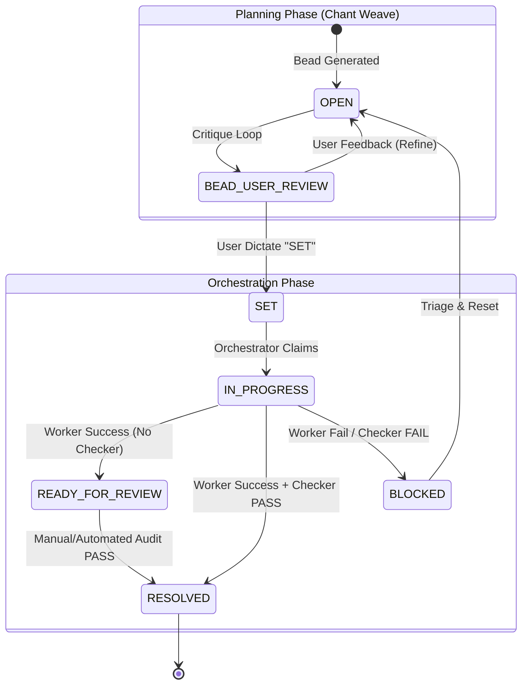

# 🔱 ORCHESTRATOR BLUEPRINT: Stateless State-Machine [Ω]

## 🎯 Executive Summary
This blueprint defines the architecture for `cstar orchestrate`, the sovereign execution engine of the Corvus Estate. It implements a **Stateless State-Machine** pattern that manages an ephemeral swarm of workers (e.g., Hermes/AutoBot) while remaining a "dumb" deterministic router.

## 🏗️ Architectural Mandates

### 1. The Yo-Yo Lifecycle
Every orchestration cycle must follow the Yo-Yo pattern to ensure system integrity and respect hardware constraints (1 MiB VRAM / 32k Context ceiling):
1.  **Deterministic Spin-up**: The orchestrator initializes, boots the `BeadLedger`, and scans for `SET` beads. It also performs **Orphan Adoption** (resetting `IN_PROGRESS` beads with stale heartbeats).
2.  **Compute**: Sub-processes (workers) are spawned in isolated environments (containers or isolated PTYs).
3.  **Forced Termination**: Workers are aggressively reaped upon completion, timeout, or parent process interruption (Signal Trapping). No worker process may persist beyond the orchestration tick. **CStar remains a Kernel; no persistent background daemons are permitted.**

### 2. Statelessness & Persistence
The orchestrator must never hold in-memory state that isn't reflected in the **Hall of Records** (`hall_beads` table).
- **Atomic Claims**: Use `BEGIN IMMEDIATE` transactions to claim beads, ensuring swarm safety.
- **Resumability**: If the orchestrator is killed, restarting it must automatically resume from the last known-good state in SQLite.
- **User "SET" Protocol (The Batch Gate)**: The Chant Weave acts as the "factory" for work. It must build, critique, and obtain a "SET" dictate for the **entire proposed bead graph** before orchestration begins. A bead is only eligible for claiming once it has reached the `SET` state.

### 3. Dumb Routing (LLM-Free Loop)
The decision of *which* skill to invoke for a bead must be deterministic:
-   `FILE` target + `logic` contract + `SET` status -> `weave:autobot` (Hermes).
-   `TEST` target + `validation` contract + `SET` status -> `weave:crucible` (Test Runner).
-   `REFACTOR` target + `forge` contract + `SET` status -> `weave:taliesin` (Forge).
## 🧩 The Micro-Bead Graph (Implementation Roadmap)

### Phase 0: The Sovereign Law
- `bead:chant:protocol`:
    - **Status**: **SET**
    - **Rationale**: Codify the "Plan-First" and "SET-Gate" lifecycle in `chant.feature`.
    - **Acceptance**: All future sessions must follow the Global Plan -> Phase -> Granular Bead (Research/Critique/SET) flow.

### Phase 1: The Spine (CLI & Scheduling)
- `bead:orch:contract`:
    - **Status**: **SET**
    - **Rationale**: Define `OrchestrateWeavePayload` in `contracts.ts`.
    - **Requirements**: Must include `planning_session_id`, `worker_identity`, `checkpoint_metadata`, and `tick_concurrency_limit`.
- `bead:orch:weave`:
    - **Status**: **SET**
    - **Rationale**: Implement the `OrchestrateWeave` adapter.
    - **Requirements**: Implement the Yo-Yo lifecycle (Spin-up -> Compute -> Reap), heartbeat pulse (SQLite `updated_at`), and per-bead atomic transactions.
- `bead:orch:bootstrap`:
    - **Status**: **SET**
    - **Rationale**: Register the weave in `bootstrap.ts`.
- `bead:orch:command`:
    - **Status**: **SET**
    - **Rationale**: Expose `cstar orchestrate` in `cstar.ts`.
    - **Requirements**: Implement foreground synchronous execution, robust Signal Trapping (SIGINT/SIGTERM), and a final exit-state report.
- `bead:orch:scheduler`:
    - **Status**: **SET**
    - **Rationale**: Implement the deterministic SET-filter and "Next Best Action" logic.
    - **Requirements**: Strictly filter for `status = 'SET'`, implement Gungnir-weighted prioritization, and include Orphan Adoption (zombie reclamation) logic.

### Phase 2: The Swarm (Worker Management)
- `bead:orch:worker-bridge`:
    - **Status**: **SET**
    - **Rationale**: Create a standard interface for workers (`IOrchestratorWorker`).
    - **Requirements**: Implement the `AutoBotWorker` adapter and real-time log redirection to SQLite.
- `bead:orch:process-manager`:
    - **Status**: **SET**
    - **Rationale**: Implement process group tracking and SIGKILL-based reaping logic.
    - **Requirements**: Use process groups (PGID) for clean reaping and implement the 2-second escalation from SIGTERM to SIGKILL.

### Phase 3: The Reap (Result & Validation)
- `bead:orch:reaper`:
    - **Status**: **SET**
    - **Rationale**: Process exit code mapping and automated triage.
    - **Requirements**: Implement exit code to status mapping (0/1/124), automated triage note generation from stderr, and "clean failure" detection.
- `bead:orch:telemetry-bridge`:
    - **Status**: **SET**
    - **Rationale**: Record execution metrics for the worker swarm.
    - **Requirements**: Record latency, exit codes, and token usage into Hall; implement the pulse() method for heartbeat reliability.

## 🛡️ Adversarial Critique (Linscott Protocol)

| Risk | Mitigation |
| :--- | :--- |
| **Race Conditions** | SQLite `BEGIN IMMEDIATE` ensures atomic bead claiming across workers. |
| **Resource Exhaustion** | Strict `--parallel` limits and OS-level process group reaping. |
| **Dependency Deadlocks** | The "Dumb Router" ignores dependencies in V1; V2 will introduce a `depends_on` bead field. |
| **Context Overspill** | Workers (Hermes) enforce 32k limits; Orchestrator pre-flights rationale size. |
| **Premature Execution** | The "User SET" protocol ensures that no bead is executed before the operator confirms the architectural intent. |

## 📊 State Transitions

## 🔱 Closing Statement
The Orchestrator is the conductor of the Corvus Symphony. By ensuring it remains stateless and deterministic, we guarantee that the system can scale to any number of nodes without losing the "One Mind" alignment.

> "Stability is the father of speed."
